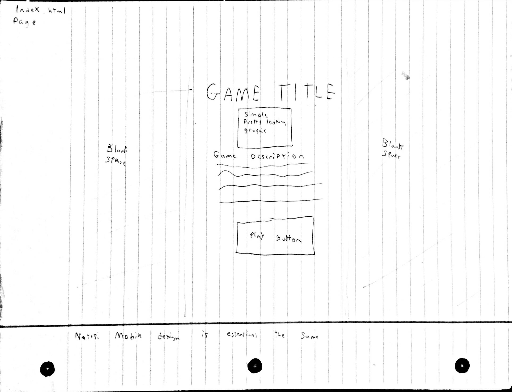
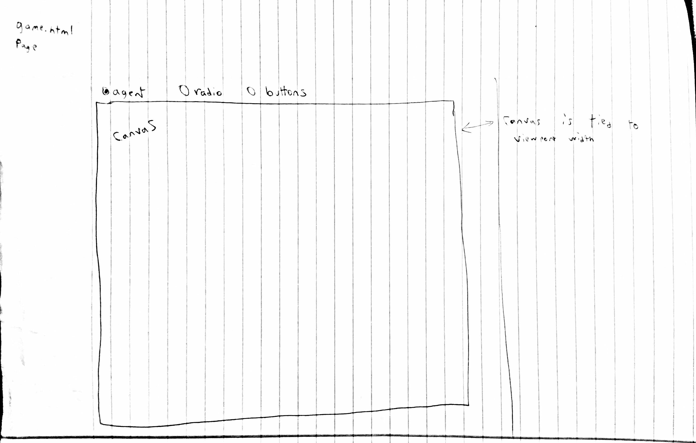

# webSafari

## Description

webSafari is a casual bullet hell game where you just try to dodge enemies that are throwing themselves at you. The game itself is be a canvas element controlled by an implementation of p5.js. The game centers around the user moving a herbivore around the screen, moving it away from predators. The game itself is very simple coding, with minimal optimizations, it runs fine in a browser and surprisingly it only chugs minimalistically on mobile devices. On mobile specifically - it is playable, but not very enjoyable. The website has five pages; one for the landing, documentation and then the 3 game pages. The visual design of the site is very simplistic. The goal was to make something that won’t catch the eye at all (so as to not distract from the game itself). Another part of the visual design is the game itself; for this, I believe I will also take a simplistic route. The aesthetics of the game are very minimalistic in order to give a more focused viewpoint.

NOTE: Originally this concept was completely different, I had to reduce my project by A LOT in order to even finish it on time because of unforseen circumstances.

## Sketches

## What I learned to accomplish this

### p5.js
 * analyzed the code from the [Nature of Code](http://natureofcode.com/book/introduction/) ([GitHub](https://github.com/shiffman/The-Nature-of-Code)) as well as experimented within p5.js.
### AI & Environment in JavaScript
 * "translated" from C# into javascript by me.
